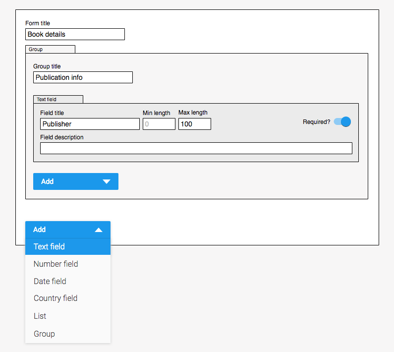

# Trial work: Create a custom form builder

## Procedure
First of all: we do not expect you to finish this project in only ~16 hours of work. We are rather interested in how you tackle it, how you structure the process and workflow, how you communicate during the process and how you care about code quality.

We suggest the following procedure:
1. Read through this document and get familiar with the task. If you have any questions or problems, just ping us in Slack. We are a team and help each others, so please do not hesitate to ask questions, ask for help or give feedback.
2. Think about a possible architecture: Which components do you need, how do they play together and try to explain it, e.g. with some pseudo code snippets, sketches or whatever tool fits you best.
3. Think about iterative steps for the implementation. We will turn these into Github issues together for our workflow. 
4. Have a short kick off meeting with us. Present your ideas and ask us all the points we forgot to clearify in the document. We are very happy to feedback your proposal and make sure we head in the same direction. You are not expected to have any kind of final solution at this time, just some basic understanding to get things started afterwards.
5. Start with the implementation: Since the time is quite limited, we understand if you do not want to wait for us to review every pull request. But we would be interested in doing at least one or two reviews. And if we manage across the timezones, it would be great to have a pair programming session – hacking together is awesome!

## Abstract
Overall you should create a json-schema-form editor with React.

## Context
We enable our clients to customise the application forms of their competitions. These forms can have quite complex and recursive structures - e.g. groups of fields, nested groups and arrays of fields or field groups. To define these forms, we manually create json form-schemas based on the [json-schema-form standard](github.com/mozilla-services/react-jsonschema-form). Below you can see a sample form-schema and here is [a nice playground](https://mozilla-services.github.io/react-jsonschema-form/) to experiment with it. These form-schemas will be rendered to forms in our front-end and tell our back-end how to validate the user input.
In the near future our customers need to create and edit these form-schemas on their own - we cannot spend all of our own time writing form-schema definitions for them. So we need a simple user interface helping them to create their forms, by creating the corresponding _json-form-schema_ under the hood.

## Schema
Here is an example form-schema for a custom form with a recursive structure. The top level is always of type `object` and defines an arbitrary set of `properties`. Every property can be a simple field (types `string` and `number`), an `array` field or another nested group of fields (type `object`). Some field types have special attributes like `minLength` and `maxLength` for string fields or `minimum` and `maximum` for `number` fields.

You can drop it into the [playground](https://mozilla-services.github.io/react-jsonschema-form/) and see how a form will be generated.

```json
{
  "type": "object",
  "title": "Book details",
  "properties": {
    "contributors": {
      "type": "array",
      "title": "Contributors",
      "description": "Please list additional contributors here.",
      "minItems": 0,
      "maxItems": 100,
      "items": {
        "type": "object",
        "required": [
          "firstName",
          "lastName"
        ],
        "properties": {
          "firstName": {
            "type": "string",
            "title": "First name",
            "maxLength": 100
          },
          "lastName": {
            "type": "string",
            "title": "Last name",
            "maxLength": 100
          }
        }
      }
    },
    "publication": {
      "type": "object",
      "title": "Publication info",
      "required": [
        "publisher",
        "date"
      ],
      "properties": {
        "publisher": {
          "type": "string",
          "title": "Publisher",
          "maxLength": 100
        },
        "date": {
          "type": "string",
          "title": "Date of publication",
          "description": "Books must be published between September 1, 2016 to September 13, 2017",
          "format": "date"
        },
        "genre": {
          "type": "string",
          "title": "Genre",
          "enum": [
            "Portrait",
            "Architecture",
            "Abstract"
          ]
        },
        "pages": {
          "type": "number",
          "title": "Number of Pages",
          "minimum": 1,
          "maximum": 10000
        },
        "additionalNotes": {
          "type": "string",
          "title": "Additional notes",
          "maxLength": 1500
        }
      }
    }
  }
}
```


## UI
The following mockup gives a basic idea of the desired user interface. During this test work please utilize a common ui framework to have some basic styling and rather focus on the functional aspects first. It's just a schematic mockup, no pixel perfect design. We don't care how buttons and input fields exactly look for this trial project, but things need to be usable.



## Tasks
1. Create a UI for the form builder. This form-builder should allow users
    - to create a new form (output should be a valid form-schema)
    - to edit an existing form (based on a valid form-schema)
2. Write unit tests, to assert that the business logic is working as expected (e.g. adding of fields, updating of fields and removing of fields).
3. Bonus: Allow to create arbitrarly deep nested forms. That means: A form can have a group of fields, that contains a group of fields, that contains a group of fields etc.
4. Bonus: Save the form in local storage, so that you can proceed to work on a form after reload.

## Technical considerations
- To ease the start for you, we setup a basic React app based on [Create React App](https://github.com/facebook/create-react-app). But feel free to remove it and use your own setup / boilerplate instead.
- Please use the following technologies unless you name us an alternative with a good reason.
    - React and Jest with [github.com/facebookincubator/create-react-app](http://github.com/facebookincubator/create-react-app)
    - Redux to fit into our existing product architecture
